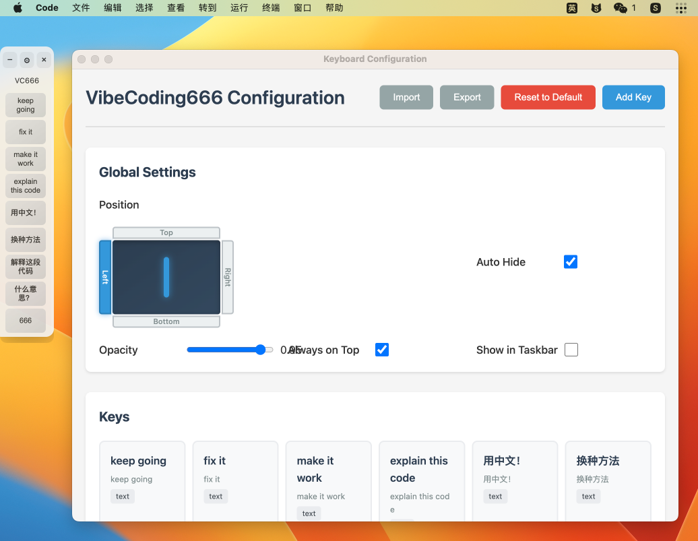

# VibeCoding666

中文 | [English](README.md)

## 人类专用章节

这是一个严肃但又抽象的项目！笑归笑，闹归闹，别拿 Vibe Coding 当玩笑！

一个专门为 Vibe Coding 设计的屏幕软键盘快捷键，灵感来源一位小红书博主求 Vibe Coding 快捷键盘。本项目可以鼠标一键输入“帮我修 bug”、“继续修 bug”、“中文回答我！”、“直接写代码”等常用 Vibe Coding 对话内容。所有按键内容也都可以自定义。将它吸附在你屏幕工作区的任意一侧，就可以尽情享用了。

项目取名 VibeCoding666 是祝福大家在 Vibe Coding 过程中全程 666。本项目也是全程使用 Vibe Coding 方式开发的，包括架构选型。除了 README 里这章节。

该框架设计兼容 macOS/Windows/Linux，但维护者目前只在 macOS 13.7 上做了主动构建和测试。




## 最新版本

- 当前版本：`v0.3.4`（2026-02-14）
- 本次更新：修复系统浅色外观下控制按钮与产品标题文字对比度不足的问题，自动切换为与按键文字一致的深色文字，提升可见性

## 快速开始

### 方案一：完整桌面应用（推荐）

```bash
cd VibeCoding666
npm install
npm start
```

### 方案二：轻量级服务器版

```bash
cd VibeCoding666/simple
npm install
node server.js
```

### 方案三：构建本地 .app（自用）

见 [自用脚手架](#自用脚手架macos-本地构建) 章节，构建一个可直接启动的本地 `.app`。无需发布、无需公证。

## 功能特性

- **自定义按键**：每个按键可自定义显示标签和输入内容
- **智能排布**：水平排布自动绑定上下边缘吸附，垂直排布自动绑定左右边缘吸附
- **UI 优化**：针对垂直模式优化的紧凑型标题栏
- **独立设置**：设置窗口不再随主窗口跳动，操作更稳定
- **跨平台框架**：macOS (Intel/Apple Silicon)、Windows、Linux —— 仅 macOS 被主动构建和测试
- **系统级输入**：点击自动输入到当前激活窗口
- **可配置外观**：调整透明度、窗口置顶
- **全局快捷键**：`Ctrl/Cmd + Alt + K` 显示/隐藏
- **配置导入导出**：方便备份和分享

## 系统要求

### macOS
```bash
xcode-select --install
```

### Windows
以管理员身份运行 PowerShell：
```powershell
npm install --global windows-build-tools
```

### Linux (Ubuntu/Debian)
```bash
sudo apt-get install libxtst-dev libpng++-dev
```

### Linux (Fedora/RHEL)
```bash
sudo dnf install libXtst-devel libpng-devel
```

## 自用脚手架（macOS 本地构建）

本节介绍本机自用的构建路径：克隆、配置、产出一个可直接启动的 `.app`。无发布、无公证、无需上架 App Store —— 只是一个用于本机个人使用的 `.app` 包。

> **范围说明**：本脚手架仅在 **macOS** 上维护。代码与 `package.json` 构建配置保持跨平台兼容（Windows/Linux target 保留以保证框架完整性），但维护者只在 macOS 上主动构建和测试。

### 前置条件

- Node.js ≥ 18
- Xcode 命令行工具（`xcode-select --install`）

> `package.json` 中 Electron 下载源默认为 `npmmirror.com` 镜像。如需更换，编辑 `build.electronDownload.mirror` 字段（或删除该字段以使用默认源）。

### 构建与启动

```bash
npm install
npm run build:mac
open dist/mac/VibeCoding666.app
```

`npm run build:mac` 会自动按当前机器的架构构建 —— Intel Mac 产出 `dist/mac/VibeCoding666.app`（x86_64），Apple Silicon 产出 `dist/mac-arm64/VibeCoding666.app`（arm64）。构建产物为解包后的 `.app` 目录（不是 DMG 安装包）。

> 若需显式构建另一种架构（例如在 Intel 上构 arm64），加 flag：`npx electron-builder --mac --arm64`；同时构两种：`npx electron-builder --mac --x64 --arm64`。

### 可选：部署到 /Applications

```bash
cp -R dist/mac/VibeCoding666.app /Applications/
```

### 首次启动的 Gatekeeper 提示

由于 `.app` 未签名，首次启动可能出现 Gatekeeper 拦截。选择其中一种方式处理：

- 在 Finder 中右键 `.app` → **打开**，或
- 一次性执行：`xattr -cr dist/mac/VibeCoding666.app`

### 系统权限

首次启动后，请在 **系统设置 → 隐私与安全性 → 辅助功能** 中允许 `VibeCoding666.app` 本身（不是 Terminal）。完整的故障排查流程见 [系统权限与安全提示](#系统权限与安全提示)。

### 配置位置

`~/Library/Application Support/VibeCoding666/`

删除此目录可彻底重置应用状态。

## 安装问题

如果安装失败，通常是原生模块编译问题：

```bash
# 清理缓存
npm cache clean --force
rm -rf node_modules package-lock.json

# 重新安装
npm install
```

## 系统权限与安全提示

> ⚠️ 本项目依赖 `robotjs` 进行系统级输入模拟。若点击按键后没有输入，通常不是功能异常，而是被系统权限或安全策略拦截。

### macOS（重点）

首次运行后，请授予“辅助功能”权限：

1. 打开 **系统设置** → **隐私与安全性** → **辅助功能**
2. 将运行本项目的程序加入并开启权限：
	- 开发运行：`Terminal` / `iTerm`（你在哪个终端执行 `npm start`，就给哪个终端授权）
	- 打包运行：`VibeCoding666.app`
3. 关闭并重新启动应用

若仍无法输入，可继续检查：

- **隐私与安全性** → **输入监控**：将对应终端或 `VibeCoding666.app` 加入允许列表后重启应用
- **隐私与安全性** → **自动化**：若出现相关弹窗，允许控制目标应用

### Windows

Windows 可能因权限级别或安全软件拦截导致输入失败：

1. 右键以“**管理员身份运行**”启动应用（或启动应用的终端）
2. 若目标程序也是管理员权限，请确保本应用同样以管理员权限运行
3. 在 Windows Defender/第三方杀软中，将应用目录加入信任或白名单

### Linux

Linux 桌面环境差异较大，常见限制如下：

1. **Wayland** 会话通常限制模拟输入，建议切换到 **X11/Xorg** 会话后再使用
2. 确认已安装依赖（见上方 Linux 系统要求）
3. 若通过远程桌面或沙箱环境运行，可能被会话策略拦截，请在本地桌面会话中测试

## 使用说明

1. **显示/隐藏**：快捷键 `Ctrl/Cmd + Alt + K`
2. **移动位置**：按住标题栏拖动
3. **自定义按键**：点击 ⚙ 设置按钮
4. **配置管理**：支持导入/导出 JSON 配置文件

## 技术栈

- **Electron**: 跨平台桌面框架
- **robotjs**: 系统级输入模拟
- **HTML5/CSS3**: 用户界面

## 配置文件位置

- macOS: `~/Library/Application Support/VibeCoding666/`
- Windows: `%APPDATA%/VibeCoding666/`
- Linux: `~/.config/VibeCoding666/`

## 卸载说明

### Windows

使用安装包自带的卸载程序时，会弹出确认框：
- 选择 `No`：仅卸载程序，保留用户数据
- 选择 `Yes`：卸载程序并删除用户数据（配置和自定义按键）

### macOS

可运行卸载工具：
```bash
npm run uninstall:mac
```

脚本会先卸载应用，再询问是否清除用户数据（配置和自定义按键）。

### Linux

可运行卸载工具：
```bash
npm run uninstall:linux
```

脚本会先尝试卸载 `vibecoding666` 包（如已安装），再询问是否清除用户数据（配置和自定义按键）。

## 许可

MIT（详见 `LICENSE`）
